<p align="center">
  <h1 align="center">Legacy Squad Framework</h1>
  <p align="center"><strong>AI-Powered Legacy Modernization Platform</strong></p>
  <p align="center"><em>Understand. Plan. Modernize.</em></p>
  <p align="center">
    <a href="README.pt-br.md">🇧🇷 Português</a> · <strong>🇺🇸 English</strong>
  </p>
</p>

<p align="center">
  <a href="https://www.npmjs.com/package/legacy-squad"></a>
  <a href="https://www.npmjs.com/package/legacy-squad"></a>
  <a href="https://github.com/hrpimenta/legacy-squad/blob/main/LICENSE"></a>
  <a href="https://github.com/hrpimenta/legacy-squad/stargazers"></a>
  
  
</p>

---

> **One command. Five AI agents in your IDE.**  
> **50 findings, 4 engineering documents, and 37 execution specs** — without changing a single line of your code.

```bash
npx legacy-squad install
```

<p align="center">
  
</p>

<p align="center">
  🔑 <strong>Zero API keys</strong> &nbsp;·&nbsp;
  ☁️ <strong>Zero external servers</strong> &nbsp;·&nbsp;
  💻 <strong>Runs in your own IDE</strong> (Claude Code, Codex, Cursor)
</p>

---

## 📊 Validated in Production

Real production mobile app — **~18,000 LoC**, **98 dependencies**, real financial transactions:

| | |
|---|---|
| 🔍 **50 findings** (7 deterministic + 43 from AI agents) | 📐 **63 business rules** extracted from code (11 implicit) |
| 📄 **4 official documents** (PRS · SDD · MMP · Specs) | 🎯 **37 execution specs**, atomic and deployable |
| 📈 **Execution Readiness:** 38 → 88 / 100 | 🚀 **Deployability:** scored per phase |

From a single `npx legacy-squad install` followed by 9 slash commands in the IDE.

[**→ Read the full case study**](docs/CASE_STUDY.md)

---
## 🚀 Quick Start

> From zero to your first AI-generated finding in minutes.

### Prerequisites

- **Node.js ≥ 18**
- **An AI-enabled IDE:** [Claude Code](https://docs.anthropic.com/en/docs/claude-code), [Codex CLI](https://github.com/openai/codex), or [Cursor](https://cursor.sh)

### 1. Install in your legacy project

```bash
cd your-legacy-project
npx legacy-squad install
```

Immediately after, you'll see the framework artifacts in `.legacy-squad/memory/`:

- `repo-index.json` — full inventory (stack, modules, dependencies, integrations)
- `findings.json` — deterministic security findings (OWASP / CWE)
- `context-packs.json` — context per module, prepared for the AI agents

<details>
<summary><strong>What the install command does internally</strong></summary>

1. Detects the stack via manifest (`package.json`, `composer.json`, `.csproj`, `pom.xml`)
2. Scans the repository and builds the inventory
3. Runs the Compliance Engine with OWASP / CWE rules
4. Generates Context Packs per module (token-efficient)
5. Installs the 9 agents as slash commands in your IDE
6. Verifies the installation (8 health checks)

</details>

### 2. Run your first AI agent

Open your IDE in the project and trigger the Security Agent.

**Claude Code**
```bash
claude
/legacy-squad-security
```

**Codex CLI**
```bash
codex
@legacy-squad-security
```

The assessment is written to:

```
.legacy-squad/outputs/assessments/security.md
```

Evidence-driven: every finding includes file:line references, OWASP / CWE mapping, impact, and recommendation — generated by AI running entirely inside your IDE.

### 3. Run the full diagnostic

Once you're satisfied with the first agent, run the remaining four and the four artifact generators.

<details>
<summary><strong>Full workflow — 5 agents + 4 generators</strong></summary>

**Step 1 — Analysis (run in order)**

```bash
/legacy-squad-security              # Security Agent
/legacy-squad-architecture          # Architecture Agent
/legacy-squad-legacy-code           # Legacy Code Agent
/legacy-squad-business-rules        # Business Rules Agent
/legacy-squad-modernization         # Modernization Agent
```

**Step 2 — Consolidated artifacts (run after analysis)**

```bash
/legacy-squad-generate-prs          # Product Refactor Specification
/legacy-squad-generate-sdd          # Software Design Document
/legacy-squad-generate-mmp          # Modernization Master Plan
/legacy-squad-generate-specs        # Execution Specs (one YAML per unit of work)
```

</details>

### Other commands

```bash
npx legacy-squad scan               # Re-scan without reinstalling agents
npx legacy-squad doctor             # Verify installation health
```
## Why Legacy Squad

Most existing tools cover one dimension of legacy modernization. Legacy Squad covers the full lifecycle — from inventory to executable plan — and treats AI agents as **methodology-bound contributors**, not free-form chat.

| Capability | Static Analyzers<br>(SonarQube) | SAST / SCA<br>(Snyk, Checkmarx) | AI Coding Assistants<br>(Copilot, Cursor) | **Legacy Squad** |
|---|:---:|:---:|:---:|:---:|
| Deterministic security rules (OWASP / CWE) | ✅ | ✅ | — | ✅ |
| CVE / dependency vulnerabilities | — | ✅ | — | — |
| Code smells & cognitive complexity | ✅ | partial | — | ✅ |
| Architecture mapping (C4, coupling) | — | — | — | ✅ |
| Business rules extraction from code | — | — | — | ✅ |
| Phased modernization plan (MMP) | — | — | — | ✅ |
| Atomic, deployable execution specs | — | — | — | ✅ |
| AI agents with evidence-bound output | — | — | free-form | ✅ |
| Runs in your own IDE (no server, no API key) | — | — | ✅ | ✅ |
| Repository never sent in full to an LLM | n/a | n/a | — | ✅ |

In one sentence: Legacy Squad pairs **deterministic scanning** with **methodology-bound AI agents** that produce **structured engineering artifacts** (PRS, SDD, MMP, Execution Specs) — not chat history.

### When Legacy Squad fits

- You have a legacy system in production and need a **structured diagnostic** before deciding what to modernize.
- You want every finding to carry **evidence, framework reference, impact, and recommendation** — not unjustified suggestions.
- You need a **phased modernization plan** that is reversible, deployable, and approvable by humans before execution.
- You want AI assistance **without sending your codebase to an external server** or paying for another seat.

### When it doesn't

- For pure CVE / dependency vulnerability scanning, use [Snyk](https://snyk.io), [Dependabot](https://github.com/dependabot), or equivalents — they specialize in this and Legacy Squad does not replace them.
- For continuous CI/CD code-quality gates, use [SonarQube](https://www.sonarsource.com/products/sonarqube/) — Legacy Squad is a **diagnostic and planning** framework, not a continuous quality monitor.
- For in-editor autocomplete or general coding chat, [GitHub Copilot](https://github.com/features/copilot) and [Cursor](https://cursor.sh) already serve that purpose — Legacy Squad starts where those stop.

---
## How It Works

```
                    ┌─────────────────────┐
                    │ npx legacy-squad    │
                    │     install         │
                    └─────────┬───────────┘
                              │
              ┌───────────────┼───────────────┐
              ▼               ▼               ▼
        ┌──────────┐  ┌────────────┐  ┌────────────┐
        │ Scanner  │  │ Compliance │  │  Context   │
        │ (stack,  │  │  Engine    │  │  Manager   │
        │ modules) │  │ (OWASP)   │  │ (packs)    │
        └────┬─────┘  └─────┬──────┘  └─────┬──────┘
             │               │               │
             ▼               ▼               ▼
        ┌──────────────────────────────────────────┐
        │        .legacy-squad/memory/             │
        │  repo-index.json | findings.json |       │
        │  context-packs.json                      │
        └──────────────────┬───────────────────────┘
                           │
              ┌────────────┼────────────┐
              ▼            ▼            ▼
        ┌──────────┐ ┌──────────┐ ┌──────────┐
        │ .claude/ │ │ AGENTS.md│ │ .cursor/ │
        │ commands/│ │ (Codex)  │ │ rules/   │
        │ (Claude) │ │          │ │ (Cursor) │
        └────┬─────┘ └────┬─────┘ └────┬─────┘
             │             │             │
             └─────────────┼─────────────┘
                           │
                    ┌──────▼──────┐
                    │  IDE + AI   │
                    │ (Claude Code│
                    │  Codex,     │
                    │  Cursor)    │
                    └──────┬──────┘
                           │
                    ┌──────▼──────┐
                    │ Assessments │
                    │ + Final PRS │
                    └─────────────┘
```

**The framework prepares data and installs agents. AI runs in the dev's IDE.**

Zero API keys required. Zero external server calls. Everything runs locally.

---

## Installed Structure

After `npx legacy-squad install`:

```
your-project/
├── .legacy-squad/
│   ├── config/
│   │   └── project.yaml              # Detected configuration
│   ├── memory/
│   │   ├── repo-index.json            # Repository inventory
│   │   ├── findings.json              # Compliance engine findings
│   │   └── context-packs.json         # Context per module
│   ├── outputs/
│   │   ├── assessments/               # Agent assessments (5 .md files)
│   │   ├── reports/                   # PRS.md + PRS.json
│   │   ├── sdd/                       # SDD.md + SDD.json
│   │   ├── mmp/                       # MMP.md + MMP.json
│   │   └── specs/                     # SPEC-*.yaml + INDEX.md
│   └── logs/
│       └── install.log
├── .claude/
│   └── commands/
│       └── legacy-squad/
│           ├── security.md            # /legacy-squad-security
│           ├── architecture.md        # /legacy-squad-architecture
│           ├── legacy-code.md         # /legacy-squad-legacy-code
│           ├── business-rules.md      # /legacy-squad-business-rules
│           ├── modernization.md       # /legacy-squad-modernization
│           ├── generate-prs.md        # /legacy-squad-generate-prs
│           ├── generate-sdd.md        # /legacy-squad-generate-sdd
│           ├── generate-mmp.md        # /legacy-squad-generate-mmp
│           ├── generate-specs.md      # /legacy-squad-generate-specs
│           └── scan.md                # /legacy-squad-scan
└── AGENTS.md                          # Codex compatibility
```

---

## Agents

### Security Agent (`/legacy-squad-security`)

Analyzes authentication, secrets, insecure storage, PII exposure, and privacy compliance (LGPD, GDPR).

**References:** OWASP MASVS V2, OWASP ASVS, CWE Top 25, LGPD, GDPR, NIST SSDF

### Architecture Agent (`/legacy-squad-architecture`)

Maps current architecture with C4 diagrams, identifies coupling, structural risks, and proposes incremental target architecture.

**References:** C4 Model, Clean Architecture, arc42, ADR

### Legacy Code Agent (`/legacy-squad-legacy-code`)

Identifies hotspots, duplication, JS→TS migration progress, test coverage, and refactoring priorities.

**References:** Clean Code, Sonar Rules, Cognitive Complexity

### Business Rules Agent (`/legacy-squad-business-rules`)

Extracts business rules hidden in code — validations, permissions, flows, magic numbers, implicit rules in catch blocks.

**References:** DDD, Event Storming

### Modernization Agent (`/legacy-squad-modernization`)

Synthesizes all assessments into an incremental plan with phases, rollback, Deployability Score (1-10), and Execution Readiness Score (0-100).

**References:** Strangler Fig, Branch by Abstraction, Progressive Delivery

### PRS Generator (`/legacy-squad-generate-prs`)

Consolidates all assessments into the PRS (Product Refactor Specification) — the diagnostic report for decision makers.

### SDD Generator (`/legacy-squad-generate-sdd`)

Produces the Software Design Document with current and target architecture (Mermaid C4 diagrams), component inventory, integrations, cross-cutting concerns (security, observability, error handling, configuration), constraints, and Architecture Decision Records (ADRs) with alternatives considered.

**References:** C4 Model, arc42, ADR, Clean Architecture

### MMP Generator (`/legacy-squad-generate-mmp`)

Produces the Modernization Master Plan with phase roadmap (Foundation → Core → Evolution, with optional Emergency phase when critical findings exist), stack upgrade plan, risk matrix, rollback strategy per phase, Execution Readiness Score (0-100) justified dimension by dimension, Deployability Score per phase, and success metrics across security, code quality, test coverage, and architecture.

**References:** Strangler Fig, Branch by Abstraction, Progressive Delivery

### Execution Specs Generator (`/legacy-squad-generate-specs`)

Decomposes the MMP into atomic Execution Specs — one YAML file per unit of work, each individually deployable, with binary acceptance criteria, mandatory rollback strategy, evidence traceability (compliance finding IDs + assessment references), dependency graph between specs, and explicit `human_approval_required` flag for high-risk changes.

**References:** FRAMEWORK_SPECIFICATION Section 8 (Execution Spec schema)

---

## Supported Stacks

### Manifest Detection (Layer 1 — deterministic)

| Manifest | Stack |
|----------|-------|
| `package.json` | Node.js, React, React Native, Expo, Next.js |
| `composer.json` | PHP, Laravel |
| `.csproj` | C#, .NET |
| `pom.xml` | Java, Spring Boot |

### Extension Detection (Layer 2 — heuristic)

TypeScript, JavaScript, PHP, C#, Java, Python, Dart

---

## Compliance Engine

The scanner automatically runs deterministic rules based on OWASP and CWE:

| Rule | Detects | Stacks | Reference |
|------|---------|--------|-----------|
| SEC-CRED-001 | Hardcoded credentials (passwords, API keys, tokens) | all | OWASP MASVS, CWE-798 |
| SEC-CRED-002 | Keystores/certificates committed to repository | mobile, all | OWASP MASVS, CWE-312 |
| SEC-SQL-001 | SQL injection (string concatenation in queries) | PHP, .NET, Java, Node | OWASP A03, CWE-89 |
| SEC-CRYPTO-001 | Weak cryptography (MD5, SHA1) | PHP, .NET, Java, Node | OWASP A02, CWE-327 |
| SEC-DESER-001 | Insecure deserialization (BinaryFormatter, `unserialize`, `readObject`) | .NET, PHP, Java | OWASP A08, CWE-502 |
| SEC-CMD-001 | Command injection (`exec`, `Runtime.exec`, `shell_exec` with user input) | PHP, .NET, Java, Node | OWASP A03, CWE-78 |
| SEC-PATH-001 | Path traversal (unvalidated file paths) | PHP, .NET, Java, Node | OWASP A01, CWE-22 |
| SEC-XSS-001 | XSS via unescaped output (`echo $_GET`, `Html.Raw`) | PHP, .NET | OWASP A03, CWE-79 |
| SEC-LOG-001 | Active `console.log` in production | JS/TS, mobile | CWE-532 |
| SEC-LOG-002 | PII (CPF, SSN, IDs) in logs/external services | all | CWE-532, LGPD/GDPR |
| SEC-ERR-001 | Empty catch blocks | all | CWE-390 |
| SEC-STORE-001 | Token in AsyncStorage (insecure storage) | mobile | OWASP MASVS |
| CQ-MIX-001 | Mixed JS and TS files (incomplete TS migration) | JS/TS | Clean Code |
| CQ-DEPRECATED-001 | Deprecated APIs (`mysql_*`, `ereg`, `Vector`) | PHP, Java | CVE-classified |

Every finding includes: evidence (file, line, snippet), impact, technical reference, and recommendation.

---

## Principles

| Principle | Description |
|-----------|-------------|
| **Install-First** | One command installs everything. No manual setup. |
| **IDE-Native** | Agents are IDE slash commands. AI comes from the dev's environment. |
| **Evidence-Driven** | Every finding has concrete evidence (file, line, snippet). |
| **Context-First** | No LLM receives the entire repository — only context packs. |
| **Read-Only** | The framework does not modify code. It only reads and generates reports. |
| **Production-First** | Every recommendation assumes the system is in production. |
| **Incremental** | Every modernization step is incremental, reversible, and deployable. |

---

## Validated in Production

The framework was validated against a **production mobile app** (~18k lines of code, 98 dependencies, real financial transactions):

**Compliance Engine (deterministic):** 7 findings via pattern matching

**AI Agents (via Claude Code):** +43 additional findings, including:
- Service account credentials decoded from Base64 in source code
- Remote config flag capable of bypassing all authentication in production
- User passwords logged in plaintext to a cloud database
- PII used as primary key in a cloud database (enumerable)
- Session recording capturing sensitive data without user consent
- 63 business rules extracted from code (11 implicit, never documented)
- Potential bug in a date calculation affecting core business logic

**Generated artifacts (4 official deliverables of V1):**
- **PRS** — Product Refactor Specification consolidating the diagnostic
- **SDD** — Software Design Document with current/target architecture and 8 ADRs
- **MMP** — Modernization Master Plan with 4-phase roadmap (Emergency → Foundation → Core → Evolution), Execution Readiness Score 38→88/100, Deployability scores per phase, and concrete rollback strategies
- **37 Execution Specs** — atomic, individually deployable units of work with binary acceptance criteria, mandatory rollback, evidence traceability, and dependency graph

**Total:** 50 findings + 4 consolidated artifacts + 37 executable specs from a single `npx legacy-squad install` followed by 9 slash command activations.

---

## Open Core

### Community Edition (V1) — Open Source

Focus: **Understand + Plan**

- Scanner with multi-stack detection (PHP/Laravel/Symfony, .NET/ASP.NET, Java/Spring, Node, React Native/Expo)
- Compliance Engine with 14 deterministic rules (OWASP MASVS, ASVS, CWE Top 25)
- Context Manager (basic)
- **5 analysis agents** as slash commands: security, architecture, legacy-code, business-rules, modernization
- **4 artifact generators** as slash commands: PRS, SDD, MMP, Execution Specs
- Claude Code, Codex CLI support (Cursor / Gemini CLI on the roadmap)

### Enterprise Edition (V2) — In development

Focus: **Modernize**

- Execution Engine (AI-assisted refactoring)
- Pull Request Engine
- QA Gates
- CI/CD Integration
- Custom Rule Packs
- Dashboard + Team Collaboration

---

## Roadmap

| Horizon | Phase | Status |
|---|---|---|
| **Now** | V1 Community — continuous improvements | 🔵 Active |
| **Next** | V2 Enterprise — execution, refactoring, PRs | 🟡 In design |
| **Later** | V3 Autonomous — continuous modernization | ⚪ Vision |

[**→ Full roadmap**](ROADMAP.md)

---

## Development

```bash
git clone https://github.com/hrpimenta/legacy-squad.git
cd legacy-squad
pnpm install
pnpm approve-builds esbuild

# Tests
npx vitest run

# Dev mode (no build)
npx tsx apps/cli/src/index.ts install -p /path/to/project

# Build
node build.mjs

# Test bundled version
node dist/cli.mjs install -p /path/to/project
```

### Monorepo Structure

```
legacy-squad/
├── packages/
│   ├── core/         # Domain types, ports (Clean Architecture)
│   ├── scanner/      # Stack detection, repo index generation
│   ├── context/      # Context packs builder
│   ├── rules/        # Compliance engine, rule catalog
│   ├── agents/       # Agent definitions, installer, doctor
│   └── output/       # PRS generator
├── apps/
│   └── cli/          # CLI entry point (Commander.js)
├── templates/
│   └── claude-commands/  # Slash command templates
└── docs/
    └── plans/        # Architecture decisions, plans
```

### Tests

```bash
npx vitest run          # 93 tests (domain, scanner, compliance, agents, installer)
npx vitest --watch      # Watch mode
```

---

## Contributing

We welcome contributions. See [CONTRIBUTING.md](CONTRIBUTING.md) for:

- How to add a Compliance Engine rule
- How to improve agent templates
- How to add IDE support
- Engineering standards (TDD, SOLID, security)
- Commit conventions and PR process

For questions and proposals, [open a discussion](https://github.com/hrpimenta/legacy-squad/discussions).

---

## License

MIT — see [LICENSE](LICENSE) for details.

---

<p align="center">
  <strong>Understand. Plan. Modernize.</strong>
  <br>
  <em>Legacy Squad Framework</em>
</p>
