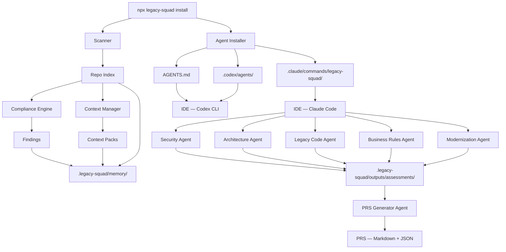

# Legacy Squad Framework
## Technical Architecture Specification (TAS) Enterprise v1.0.1

**Slogan:** Understand. Plan. Modernize.
**Revision:** 1.0.1 — AIOX-Inspired IDE-Native Architecture

---

## 1. Purpose

Este documento define a arquitetura técnica do Legacy Squad Framework V1, também chamado de Discovery Platform.

A V1 permite instalar-se dentro de um repositório legado e, através de agentes nativos da IDE, gerar:

- PRS — Product Refactor Specification;
- SDD — Software Design Document;
- MMP — Modernization Master Plan;
- Execution Specs.

A V1 não altera código, não cria PRs e não executa refatoração automática.

---

## 2. Architectural Principles

### Install-First

O framework se instala dentro do projeto alvo com um único comando. Toda configuração, dados e agentes vivem no repositório.

### IDE-Native

Agentes são slash commands da IDE (Claude Code, Codex, Cursor). A IA vem do ambiente do dev, não de chamadas API do framework.

### Local First

Toda execução ocorre localmente.

### Read-Only by Default

A V1 apenas lê arquivos e gera relatórios.

### LLM Agnostic

A IA é executada pela IDE do dev. O framework é agnóstico ao modelo.

IDEs suportadas:

- Claude Code (primária);
- Codex CLI;
- Gemini CLI;
- Cursor.

### Context First

Nenhum agente recebe o repositório inteiro. O scanner gera um Repo Index e Context Packs que direcionam o agente para os arquivos relevantes.

### Evidence Driven

Todo achado deve conter evidência, impacto, padrão e recomendação.

### Open Core Ready

A arquitetura separa V1 Community e V2 Enterprise.

---

## 3. High-Level Architecture



---

## 4. Recommended Stack

- Node.js;
- TypeScript;
- pnpm;
- Commander.js;
- Vitest;
- ESLint;
- Markdown, JSON e YAML.

---

## 5. Framework Structure (pacote NPX)

```text
legacy-squad/
├── packages/
│   ├── core/               # Domain types, ports
│   ├── scanner/             # Stack detection, repo index
│   ├── context/             # Context packs builder
│   ├── rules/               # Compliance engine, rule catalog
│   ├── agents/              # Agent definitions, IDE installer
│   └── output/              # PRS generator
├── templates/
│   ├── claude-commands/     # Templates dos slash commands
│   ├── codex-agents/        # Templates AGENTS.md
│   └── cursor-rules/        # Templates .cursor/rules
├── tests/
│   ├── fixtures/
│   ├── integration/
│   └── e2e/
├── bin/
│   └── legacy-squad.ts      # CLI entry point
├── package.json
├── pnpm-workspace.yaml
├── tsconfig.json
└── README.md
```

---

## 6. CLI Commands

```bash
npx legacy-squad install
npx legacy-squad init <project-name>
npx legacy-squad scan
npx legacy-squad doctor
npx legacy-squad update
```

### install

Instala o framework dentro do projeto existente:

1. detecta stack e gera repo-index.json;
2. roda compliance engine e gera findings.json;
3. gera context-packs.json;
4. instala `.legacy-squad/` com dados;
5. instala `.claude/commands/legacy-squad/` com agentes;
6. gera `AGENTS.md` na raiz (Codex compatibility);
7. exibe resumo e próximos passos.

### init

Executa wizard interativo para novo projeto e depois chama `install`.

### scan

Re-executa scanner e compliance engine sem reinstalar agentes. Atualiza `.legacy-squad/memory/`.

### doctor

Verifica saúde da instalação:

- dados em `.legacy-squad/memory/` existem e são válidos;
- agentes em `.claude/commands/legacy-squad/` existem;
- versão do framework é compatível.

### update

Atualiza agentes e regras para a versão mais recente do framework.

---

## 7. Installed Project Structure

Após `npx legacy-squad install`, o projeto alvo recebe:

```text
projeto-legado/
├── .legacy-squad/
│   ├── config/
│   │   └── project.yaml
│   ├── memory/
│   │   ├── repo-index.json
│   │   ├── findings.json
│   │   └── context-packs.json
│   ├── outputs/
│   │   ├── reports/
│   │   └── assessments/
│   ├── rules/
│   │   └── catalog.json
│   └── logs/
│       └── install.log
│
├── .claude/
│   └── commands/
│       └── legacy-squad/
│           ├── scan.md
│           ├── security.md
│           ├── architecture.md
│           ├── legacy-code.md
│           ├── business-rules.md
│           ├── modernization.md
│           └── generate-prs.md
│
└── AGENTS.md
```

---

## 8. Configuration Files

### project.yaml

```yaml
project:
  name: appcooperado
  type: mobile
  stack:
    - react-native
    - typescript
    - expo

scope:
  mode: full-project
  include:
    - src
  exclude:
    - node_modules
    - build
    - dist

pillars:
  security: true
  architecture: true
  legacy_code: true
  business_rules: true
  modernization: true

mode:
  execution: read_only

ide:
  primary: claude-code
  secondary:
    - codex
    - cursor

installed_at: "2026-06-04T20:46:00Z"
framework_version: "1.0.0"
```

---

## 9. Scanner Architecture

### Strategy V1

Detecção em camadas:

1. Camada 1 — Manifesto (determinística, evidence-based): package.json, composer.json, pom.xml, .csproj;
2. Camada 2 — Extensão de arquivo (heurística): .ts, .php, .java, .cs, .py;
3. Camada 3 — Inferência (futuro V2): LLM para casos ambíguos.

### Strategy V2

AST + language-specific parsers.

### Supported Manifests V1

```text
package.json
composer.json
pom.xml
build.gradle
.csproj
requirements.txt
pyproject.toml
pubspec.yaml
.env.example
Dockerfile
docker-compose.yml
```

---

## 10. Repo Index Schema

```json
{
  "project": {
    "name": "string",
    "type": "backend | frontend | mobile | fullstack | monorepo",
    "rootPath": "string",
    "detectedAt": "datetime"
  },
  "stack": [
    {
      "name": "string",
      "type": "language | framework | runtime | library",
      "version": "string",
      "source": "string"
    }
  ],
  "modules": [
    {
      "name": "string",
      "path": "string",
      "type": "module | feature | layer | package",
      "filesCount": 0,
      "summary": "string"
    }
  ],
  "entrypoints": [
    {
      "type": "http_route | cli | job | screen | component",
      "name": "string",
      "path": "string",
      "method": "string"
    }
  ],
  "dependencies": [
    {
      "name": "string",
      "version": "string",
      "manager": "npm | composer | maven | gradle | pip | pub | nuget",
      "scope": "runtime | dev"
    }
  ],
  "integrations": [
    {
      "type": "api | database | queue | file | external_service",
      "name": "string",
      "evidence": "string",
      "path": "string"
    }
  ],
  "hotspots": [
    {
      "path": "string",
      "reason": "large_file | duplicated_logic | high_coupling | sensitive_code",
      "score": 0
    }
  ]
}
```

---

## 11. Context Manager

Responsável por:

- chunking;
- summaries;
- context packs;
- token budget;
- reuso de contexto.

### Context Pack Schema

```yaml
id: auth.context
module: auth
summary: >
  Módulo responsável por autenticação e sessão.
key_files:
  - src/auth/AuthService.ts
entrypoints:
  - POST /login
dependencies:
  - axios
risks:
  - token stored insecurely
business_rules:
  - user must be active
token_estimate: 2400
```

---

## 12. Compliance Engine

Responsável por:

- carregar regras;
- aplicar regras por stack;
- identificar matches;
- gerar achados estruturados.

### Rule Structure

```yaml
id: SEC-MOB-001
title: Token stored in insecure storage
category: security
severity: high
applies_to:
  - react-native
  - mobile
frameworks:
  - OWASP MASVS
detection:
  type: pattern
  patterns:
    - AsyncStorage.setItem
impact: >
  Authentication tokens may be exposed.
recommendation: >
  Use secure native storage.
```

---

## 13. Finding Schema

```json
{
  "id": "SEC-MOB-001",
  "title": "Token stored in insecure storage",
  "pillar": "security",
  "severity": "high",
  "evidence": [
    {
      "file": "src/context/AuthContext.tsx",
      "line": 42,
      "snippet": "AsyncStorage.setItem('token', token)"
    }
  ],
  "frameworks": ["OWASP MASVS"],
  "impact": "Authentication token may be exposed.",
  "recommendation": "Use secure native storage.",
  "priority": "P1"
}
```

---

## 14. Agent Architecture — IDE-Native

Agentes são slash commands instalados na IDE. Cada agente é um arquivo Markdown com instruções, contexto e formato de output esperado.

### Ciclo de vida do agente

```text
1. Framework instala .claude/commands/legacy-squad/{agent}.md
2. Dev ativa via /legacy-squad-{agent} no Claude Code
3. IDE lê o arquivo de instrução
4. IDE lê .legacy-squad/memory/ para contexto
5. IDE lê arquivos-fonte diretamente (acesso ao projeto)
6. IDE executa a análise (LLM)
7. IDE salva assessment em .legacy-squad/outputs/assessments/
```

### Slash Command Structure

Cada arquivo em `.claude/commands/legacy-squad/` segue a estrutura:

```markdown
# [Agent Name]

## Role
[Papel e especialização do agente]

## Context Files
Leia estes arquivos antes de analisar:
- .legacy-squad/memory/repo-index.json
- .legacy-squad/memory/findings.json
- .legacy-squad/memory/context-packs.json

## Source Files to Analyze
Com base no repo-index, leia os arquivos em:
- [diretórios relevantes para o pilar]

## Instructions
[Instruções detalhadas do que analisar e como]

## Output Format
Salve o resultado em: .legacy-squad/outputs/assessments/{agent}-assessment.md

Estrutura:
1. [Seção 1]
2. [Seção 2]
...

## Rules
- Toda afirmação deve ter evidência (arquivo, linha)
- Severidade: critical > high > medium > low > info
- Recomendações devem ser incrementais
```

### IDE Compatibility

| IDE | Mecanismo | Path |
|-----|-----------|------|
| Claude Code | Slash commands | `.claude/commands/legacy-squad/*.md` |
| Codex CLI | AGENTS.md | `AGENTS.md` na raiz |
| Gemini CLI | Rules | `.gemini/rules/legacy-squad/*.md` |
| Cursor | Rules | `.cursor/rules/legacy-squad/*` |

---

## 15. Agents

### Security Agent (`/legacy-squad-security`)

Analisa autenticação, autorização, secrets, armazenamento inseguro e exposição de dados.

Lê: stores, auth, config, utils. Referências: OWASP MASVS, CWE, LGPD.

### Architecture Agent (`/legacy-squad-architecture`)

Mapeia arquitetura atual, acoplamento, camadas e integrações.

Lê: stores, screens, routes, comps. Referências: C4, Clean Architecture, arc42.

### Legacy Code Agent (`/legacy-squad-legacy-code`)

Identifica hotspots, duplicidade, métodos grandes e código morto.

Lê: stores, screens, comps, utils. Referências: Clean Code, Sonar Rules.

### Business Rules Agent (`/legacy-squad-business-rules`)

Extrai fluxos, validações, permissões, exceções e regras implícitas.

Lê: stores, screens, routes. Referências: DDD, Event Storming.

### Modernization Agent (`/legacy-squad-modernization`)

Propõe estratégia incremental, fases, stack upgrade, deployability score e execution readiness score.

Lê: todos os módulos + assessments dos outros agentes. Referências: Strangler Fig, Branch by Abstraction, Progressive Delivery.

### PRS Generator Agent (`/legacy-squad-generate-prs`)

Consolida todos os assessments em um PRS único.

Lê: `.legacy-squad/outputs/assessments/` + findings + repo-index. Gera: `PRS.md` e `PRS.json` em `.legacy-squad/outputs/reports/`.

---

## 16. Output Strategy

Todo artefato oficial deve ser gerado em:

- Markdown para humanos;
- JSON para automação futura.

Assessments dos agentes são salvos em `.legacy-squad/outputs/assessments/`.
Relatórios consolidados são salvos em `.legacy-squad/outputs/reports/`.

---

## 17. Official Artifacts

### PRS

Estrutura:

1. Executive Summary;
2. Project Overview;
3. Current State;
4. Key Risks;
5. Security Findings;
6. Architecture Findings;
7. Legacy Code Findings;
8. Business Rules;
9. Modernization Opportunities;
10. Recommended Next Steps.

### SDD

Estrutura:

1. Overview;
2. Current Architecture;
3. Target Architecture;
4. Components;
5. Integrations;
6. Security Architecture;
7. Observability;
8. Constraints;
9. Architecture Decisions.

### MMP

Estrutura:

1. Modernization Strategy;
2. Phase Roadmap;
3. Stack Upgrade Plan;
4. Risk Matrix;
5. Rollback Strategy;
6. Deployability Score;
7. Execution Readiness Score.

### Execution Spec

```yaml
id: AUTH-001
title: Centralize authentication session handling
pillar: security
phase: foundation
risk: high
deployability_score: 7
execution_readiness: 75
affected_files:
  - src/auth/AuthContext.tsx
objective: >
  Centralize session handling.
acceptance_criteria:
  - Session rules centralized
  - Existing behavior preserved
rollback:
  strategy: revert isolated change
human_approval_required: true
```

---

## 18. Logging

```text
.legacy-squad/logs/
```

Tipos:

- install.log;
- scanner.log;
- compliance.log;
- error.log.

---

## 19. Error Handling

Tipos:

- CONFIG_ERROR;
- SCANNER_ERROR;
- INSTALL_ERROR;
- COMPLIANCE_ERROR;
- TOKEN_BUDGET_EXCEEDED;
- OUTPUT_WRITE_ERROR.

---

## 20. Security Model

Regras da V1:

- read-only;
- ignorar valores de `.env`;
- mascarar secrets no repo-index;
- não incluir secrets em findings;
- slash commands não enviam dados para fora do ambiente local.

---

## 21. Open Core Boundaries

### Community Edition

Inclui:

- CLI (install, scan, doctor);
- Scanner;
- Repo Index;
- Context Manager;
- Compliance Engine básico;
- agentes de diagnóstico (slash commands);
- PRS via agente.

### Enterprise Edition

Inclui:

- Execution Engine;
- Refactoring Engine;
- Git Worktree Manager;
- Pull Request Engine;
- QA Engine;
- Advanced Stack Upgrade Engine;
- Dashboard;
- Team Collaboration;
- Custom Rule Packs;
- CI/CD Integration.

---

## 22. ADRs Required

- ADR-001 Node.js + TypeScript;
- ADR-002 Install-First Architecture;
- ADR-003 Open Core Strategy;
- ADR-004 Read-Only V1;
- ADR-005 Markdown + JSON Outputs;
- ADR-006 IDE-Native Agents;
- ADR-007 Filesystem Persistence;
- ADR-008 Stack Detection in Layers;
- ADR-009 Pattern Matching Scanner V1;
- ADR-010 Context First Strategy;
- ADR-011 Slash Commands as Agent Interface.

---

## 23. Development Roadmap

### Sprint 1 — Foundation + Scanner

- monorepo;
- CLI base;
- scanner com detecção em camadas;
- repo index;
- compliance engine;
- regras iniciais.

### Sprint 2 — IDE Integration

- install command;
- slash command templates;
- agent installer para Claude Code;
- AGENTS.md generator para Codex;
- doctor command.

### Sprint 3 — Context Manager

- summaries;
- context packs avançados;
- token budget.

### Sprint 4 — Agent Refinement

- refinar instruções dos 5 agentes;
- testar com Claude Code real;
- PRS generator agent;
- validação end-to-end.

### Sprint 5 — Multi-IDE

- Cursor rules generator;
- Gemini CLI support;
- sync:ide command.

### Sprint 6 — Rule Expansion

- regras para PHP/Laravel;
- regras para .NET;
- regras para Java/Spring;
- regras para Node.js backend.

### Sprint 7 — SDD + MMP Agents

- SDD generator agent;
- MMP generator agent.

### Sprint 8 — Specs + E2E

- execution specs agent;
- end-to-end validation;
- packaging para npm registry.

---

## 24. V1 Acceptance Criteria

A V1 será aceita quando:

- `npx legacy-squad install` funcionar com um comando;
- scanner gerar repo index;
- compliance engine gerar findings;
- context manager gerar context packs;
- agentes estiverem instalados como slash commands;
- `/legacy-squad-security` produzir assessment real no Claude Code;
- `/legacy-squad-generate-prs` produzir PRS consolidado;
- execução local funcionar;
- Claude Code, Codex e Cursor forem suportados;
- funcionar no Windows CMD e Unix.

---

## 25. Final Architecture Statement

Legacy Squad Framework V1 é uma plataforma install-first, read-only, IDE-native e evidence-driven para transformar sistemas legados em ativos preparados para modernização incremental.

O framework gera dados e contexto. A IA vem da IDE do dev.

A V1 entende e planeja.
A V2 executa e monetiza.

**Understand. Plan. Modernize.**
